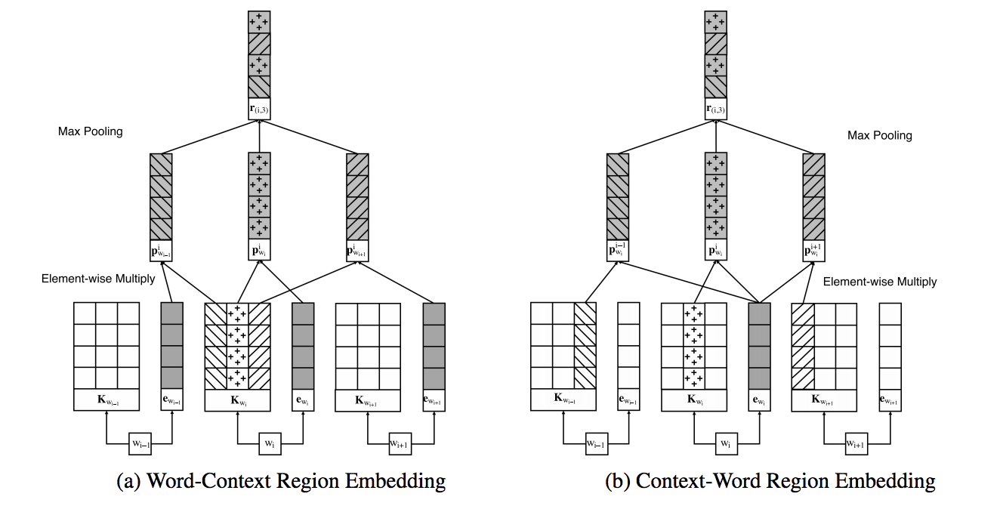

# Introduction

This is a PyTorch implementation of [A New Method of Region Embedding for Text Classification](https://openreview.net/pdf?id=BkSDMA36Z)  (ICLR 2018).



**NOTE**: in this implementation, only context-word region embedding is available for now. I do not have a plan to implement Word-Context Region Embedding
in the intermediate future. I also added a self-attention mechanism on top of the region embedding layer to get better results.

# Usage
```
python main.py [arguments]

```

# Arguments
```
-h, -help       help information
-embed_dim      dimension of word embeddings
-epochs         number of epoches

```